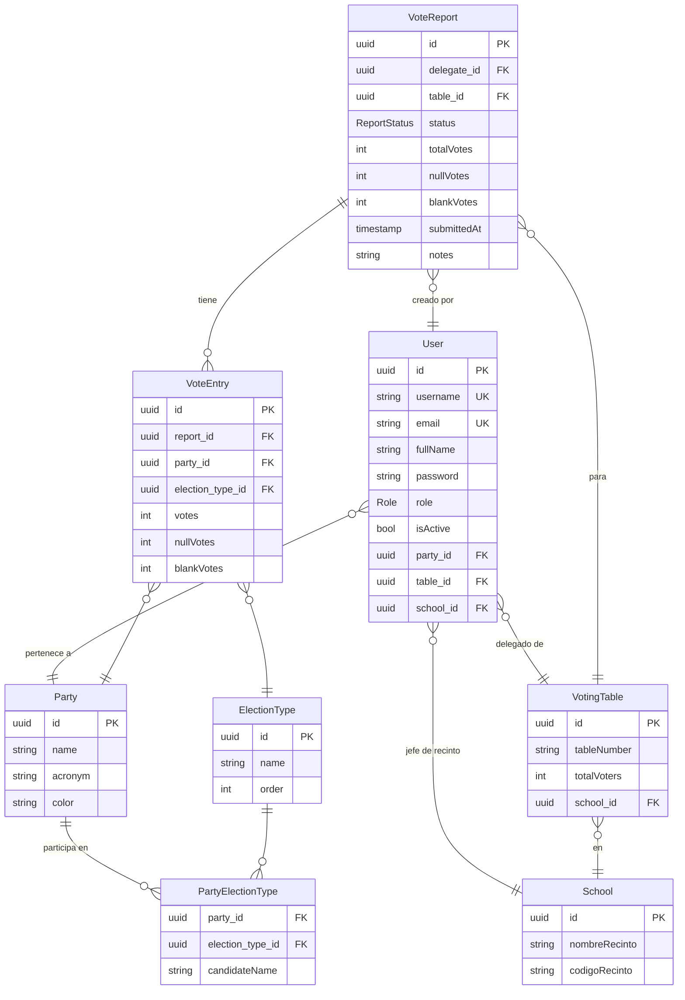

# 🗳️ Análisis Completo – VotoRápido

Sistema de **conteo rápido de votos** para autoridades locales y regionales.

---

## 1. Estructura General (Monorepo)

```
voto-rapido/
├── backend/          # NestJS API REST
├── frontend/         # Vite + React + TypeScript + Tailwind CSS
└── docker-compose.yml
```

**Despliegue Docker**: PostgreSQL 16 → Backend NestJS (:3000) → Frontend Nginx (:80).

---

## 2. Stack Tecnológico

| Capa | Tecnología |
|---|---|
| Base de datos | PostgreSQL 16 (TypeORM, `synchronize: true` en dev) |
| Backend | NestJS 10, Passport JWT, bcryptjs, Winston, Swagger, ExcelJS, PDFKit |
| Frontend | Vite 5, React 18, Tailwind CSS 3, TanStack Query v5, Zustand, React Hook Form, Axios, react-hot-toast / sonner |

---

## 3. Modelo de Datos



> **Nota de diseño**: `nullVotes` y `blankVotes` se almacenan en [VoteEntry](file:///d:/GitHub/voto-rapido/backend/src/modules/votes/vote-entry.entity.ts#7-32) (sólo en el primer entry por tipo de elección dentro de un reporte) **y** en [VoteReport](file:///d:/GitHub/voto-rapido/backend/src/modules/votes/vote-report.entity.ts#13-44) (aunque actualmente siempre se guarda en 0, sólo se usa el de [VoteEntry](file:///d:/GitHub/voto-rapido/backend/src/modules/votes/vote-entry.entity.ts#7-32)).

---

## 4. Roles y Permisos

| Rol | Descripción | Permisos clave |
|---|---|---|
| `ADMIN` | Administrador total | CRUD usuarios, partidos, recintos, mesas, tipos. **No puede** crear/verificar/eliminar reportes. Solo lee métricas globales. |
| `JEFE_CAMPANA` | Jefe de campaña de un partido | Ve todos los reportes de **su partido**. Puede verificar y eliminar reportes de su partido. |
| `JEFE_RECINTO` | Jefe de recinto | Ve/crea/actualiza/envía/verifica/elimina reportes de **su partido** en **su recinto**. |
| `DELEGADO` | Delegado de mesa | Ve y crea/actualiza/envía únicamente **sus propios reportes** (mesa asignada). |

---

## 5. Backend – Módulos

### `/auth`
- `POST /api/v1/auth/login` → devuelve JWT con payload: `{ sub, username, role, partyId, tableId, schoolId }`.
- `GET /api/v1/auth/profile` → perfil del usuario autenticado.

### `/users`
- CRUD de usuarios. ADMIN crea usuarios, asigna roles, partido, mesa o recinto.
- Password hasheado con bcryptjs en `@BeforeInsert / @BeforeUpdate`.

### `/parties`
- CRUD de partidos políticos.
- Asignación de tipos de elección a un partido (`PartyElectionType`), con nombre de candidato opcional.

### `/schools`
- CRUD de recintos electorales. Búsqueda por texto.

### `/tables`
- CRUD de mesas de votación. Relacionadas con un recinto (School). Tienen `totalVoters`.

### `/election-types`
- CRUD de tipos de elección (ej. Alcalde, Gobernador). Campo `order` para ordenar presentación.

### `/votes` ⭐ (Módulo core)
- `POST /votes/reports` → crea reporte
- `PUT /votes/reports/:id` → edita reporte (vuelve a DRAFT)
- `PATCH /votes/reports/:id/submit` → envía (DRAFT → SUBMITTED)
- `PATCH /votes/reports/:id/verify` → verifica (SUBMITTED → VERIFIED)
- `DELETE /votes/reports/:id` → soft delete
- `GET /votes/metrics` → métricas según rol

**Flujo de estado**: `DRAFT → SUBMITTED → VERIFIED`

**Validación clave**: votos por tipo de elección (válidos + nulos + blancos) no puede superar el padrón de la mesa (`totalVoters`).

**Almacenamiento nulos/blancos**: se guardan en el **primer** `VoteEntry` de cada tipo de elección en un reporte. La función `aggregateReports()` desduplicar contando nulos/blancos sólo una vez por `(report.id, electionType.id)`.

### `/reports`
- `GET /reports/export/excel` → exporta a Excel (ExcelJS)
- `GET /reports/export/pdf` → exporta a PDF (PDFKit)

### `/audit`
- Módulo de auditoría (archivos no inspeccionados completamente, probablemente logging de cambios).

---

## 6. Frontend – Páginas y Componentes

| Ruta | Página | Rol principal |
|---|---|---|
| `/login` | `LoginPage.tsx` | Todos |
| `/` | `DashboardPage.tsx` (16 KB) | Todos (vista adaptada por rol) |
| `/users` | `UsersPage.tsx` | ADMIN |
| `/parties` | `PartiesPage.tsx` (15 KB) | ADMIN |
| `/schools` | `SchoolsPage.tsx` | ADMIN |
| `/tables` | `TablesPage.tsx` | ADMIN |
| `/election-types` | `ElectionTypesPage.tsx` | ADMIN |
| `/reports` | `ReportsPage.tsx` (19 KB) | JEFE_CAMPANA, JEFE_RECINTO, DELEGADO |
| `/reports/new` | `NewReportPage.tsx` (25 KB) | DELEGADO, JEFE_RECINTO |

**Componentes compartidos**:
- `Layout.tsx` (8 KB) – Sidebar con navegación adaptada por rol.
- `CrudPage.tsx` (12 KB) – Componente genérico para las páginas CRUD del admin.

**Estado global**: Zustand con persistencia en `localStorage` (`voto-rapido-auth`). Limpia la caché de React Query en login/logout.

**Comunicación API**: Axios con interceptor que agrega el JWT en cada request y redirige a `/login` si recibe 401.

---

## 7. Infraestructura y DevOps

- **Docker Compose**: 3 servicios (postgres, backend, frontend/nginx).
- **Frontend Nginx**: sirve el SPA y hace proxy reverso a `/api/v1` → backend.
- **Logs**: Winston con archivos de log en `backend/logs/`.
- **Swagger**: disponible en `http://localhost:3000/api/docs`.
- **Seed**: `ts-node src/database/seed.ts` para datos iniciales.

---

## 8. Observaciones y Áreas de Mejora

| # | Área | Observación |
|---|---|---|
| 1 | **Tests** | No hay tests unitarios ni e2e en ninguno de los dos proyectos. |
| 2 | **TypeORM synchronize** | `synchronize: true` en producción es riesgoso (puede alterar el schema). Debería sólo estar activo en desarrollo. |
| 3 | **`nullVotes`/`blankVotes` en VoteReport** | Siempre se guarda en 0, la fuente de verdad son los `VoteEntry`. Puede generar confusión. |
| 4 | **DTOs en el service** | Los DTOs (`CreateReportDto`, `VoteEntryDto`, etc.) están definidos directamente en `votes.service.ts`. Mejor moverlos a un archivo `dto/` separado. |
| 5 | **Consultas N+1** | `buildEntries()` hace `findOne` para cada party y electionType en bucle. Podría optimizarse con una sola consulta `IN`. |
| 6 | **Ruta de reportes faltante** | No existe ruta `/reports/:id` para ver un reporte individual en el frontend (solo `new` y la lista). |
| 7 | **`JEFE_RECINTO` y creación de reporte** | Puede crear reportes en nombre del delegado de cualquier mesa de su recinto, independientemente del partido del delegado de esa mesa. Solo se valida que la mesa pertenezca al recinto. |
| 8 | **Export de reportes sin auth** | `reportsApi.exportExcel/exportPdf` usan `window.open` (nueva pestaña), por lo que no envían el JWT. El backend debería validar el token de otra forma (query param, cookie) o la ruta debería ser pública. |
| 9 | **Doble librería de toasts** | El frontend tiene tanto `react-hot-toast` como `sonner` instalados. |
